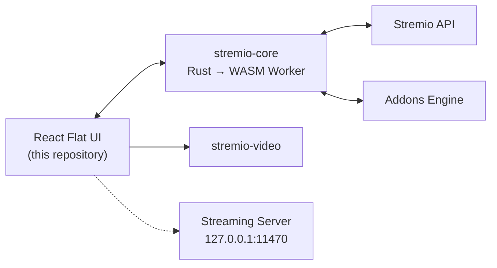

<div align="center">


# Stremio Web

**Freedom to Stream** — the official web UI of [Stremio](https://www.stremio.com), a modern media center and all-in-one streaming platform.

[](https://github.com/Stremio/stremio-web/actions/workflows/build.yml)
[](https://github.com/Stremio/stremio-web/releases)
[](/LICENSE.md)

**[🌐 Open the Web App](https://web.stremio.com)** · [Website](https://www.stremio.com) · [Report a Bug](https://github.com/Stremio/stremio-web/issues/new/choose)

</div>

---

## ✨ Features

- 🎬 **Cinematic Hero Banner** — Dynamic top carousel highlighting featured titles from active catalogs with quick playback actions.
- 📐 **Modern Flat UI** — Ultra-lightweight flat dark surfaces (`#0b0c10`, `#14171f`) with clean 1px borders, zero GPU-heavy backdrop blur, and zero gradient repainting bottlenecks.
- 📚 **Direct Library & New Episodes Shelves** — Quick home screen access to Continue Watching, unwatched new episodes with notification badges, and personal Library shelves.
- 🏷️ **Instant Category Filtering** — Smooth flat pill filters for *All*, *Movies*, *Series*, *Anime*, and *Channels* with live catalog updates.
- 🧩 **Addon-Powered Catalogs** — Infinite discoverability for movies, series, YouTube, and live channels powered by community addons.
- 🔄 **Universal Sync** — Seamlessly synchronizes your library, watch progress, and addon configurations across all your devices.
- 📺 **Chromecast Streaming** — Cast videos directly to big screens and smart TVs.
- 💬 **Advanced Subtitles** — Custom sizing, colors, font offsets, and real-time addon subtitle integration.
- ⌨️ **Keyboard & Gamepad First** — Full navigation and playback support without requiring a mouse.
- 🌍 **50+ Languages** — Community localized via [stremio-translations](https://github.com/Stremio/stremio-translations).
- 🖥️ **Native Linux App Support** — Built-in [Tauri v2](https://v2.tauri.app) packaging with embedded Stremio Streaming Server (EngineFS).

---

## 🛠 Architecture

The frontend is a React application powered by [stremio-core](https://github.com/Stremio/stremio-core) — Stremio's high-performance Rust state machine compiled to WebAssembly running inside a dedicated Web Worker:



---

## 🚀 Getting Started

### Prerequisites
- **Node.js**: `v22+`
- **pnpm**: `v11+`
- *(Optional for desktop builds)* **Rust / Cargo**: `v1.75+`

### Quick Start
```bash
# Clone the repository
git clone https://github.com/khSafvan/my-stremio-web.git
cd my-stremio-web

# Install dependencies
pnpm install

# Start development server with hot reload
pnpm start
# or use the helper script:
./scripts/dev.sh
```

The application will be available at `http://localhost:8080`.

---

## 📜 NPM Scripts & Helper Scripts

### NPM Scripts
| Command | Description |
|---|---|
| `pnpm start` | Run Webpack dev server with hot module replacement |
| `pnpm run dev` | Launch dev server via `./scripts/dev.sh` with environment verification |
| `pnpm run build` | Compile optimized production bundle to `/build` |
| `pnpm test` | Run complete Jest test suite (70 unit tests) |
| `pnpm run lint` | Run ESLint across `src/` |
| `pnpm run lint:fix` | Automatically fix linting violations |
| `pnpm run format` | Format code with Prettier |
| `pnpm run format:check` | Verify code formatting with Prettier |
| `pnpm run scan-translations` | Run AST scan ensuring no untranslated JSX text strings |
| `pnpm run server:download` | Download official Stremio Streaming Server bundle (`server/server.js`) |
| `pnpm run server:run` | Start local streaming server on `127.0.0.1:11470` |
| `pnpm run desktop` | Launch Tauri Linux desktop app in development mode |
| `pnpm run tauri:build` | Build production Linux desktop binaries (.AppImage, .deb) |
| `pnpm run docker:run` | Build and launch containerized application |

### Helper Shell Scripts (`scripts/`)
All scripts in `scripts/` are executable, idempotent, and include strict error handling (`set -euo pipefail`):

| Script | Usage | Purpose |
|---|---|---|
| [`dev.sh`](file:///home/zack/Workshop/my-stremio-web/scripts/dev.sh) | `./scripts/dev.sh` | Validates Node/pnpm environments and starts dev server |
| [`build.sh`](file:///home/zack/Workshop/my-stremio-web/scripts/build.sh) | `./scripts/build.sh`<br>`CLEAN=true ./scripts/build.sh` | Compiles production assets with optional clean step |
| [`test.sh`](file:///home/zack/Workshop/my-stremio-web/scripts/test.sh) | `./scripts/test.sh` | Executes Jest test suite and translation AST checks |
| [`lint.sh`](file:///home/zack/Workshop/my-stremio-web/scripts/lint.sh) | `./scripts/lint.sh`<br>`./scripts/lint.sh --fix` | Runs ESLint and Prettier checks with auto-fix support |
| [`desktop.sh`](file:///home/zack/Workshop/my-stremio-web/scripts/desktop.sh) | `./scripts/desktop.sh`<br>`./scripts/desktop.sh build` | Manages native Tauri desktop dev & packaging workflows |
| [`download-server.sh`](file:///home/zack/Workshop/my-stremio-web/scripts/download-server.sh) | `./scripts/download-server.sh` | Downloads official Stremio EngineFS server bundle |
| [`run-server.sh`](file:///home/zack/Workshop/my-stremio-web/scripts/run-server.sh) | `./scripts/run-server.sh` | Launches standalone local server on port 11470 |
| [`docker-run.sh`](file:///home/zack/Workshop/my-stremio-web/scripts/docker-run.sh) | `./scripts/docker-run.sh` | Builds and runs Stremio Web in a Docker container |

---

## 🖥️ Native Linux Desktop Application (Tauri v2)

Stremio Web can be built and run as a lightweight native Linux desktop application powered by **Tauri v2** with the **Stremio Streaming Server** automatically supervised in the background:

```bash
# 1. Download streaming server bundle
./scripts/download-server.sh

# 2. Run in development mode
./scripts/desktop.sh
# or:
pnpm run desktop

# 3. Build production distribution (.AppImage and .deb)
./scripts/desktop.sh build
# or:
pnpm run tauri:build
```

Desktop binaries are compiled to `src-tauri/target/release/stremio`. The desktop application automatically starts the local EngineFS server on `127.0.0.1:11470` and terminates it cleanly when closed.

---

## 🐳 Docker Deployment

To build and run in a container:
```bash
# Using the helper script:
./scripts/docker-run.sh

# Or using Docker directly:
docker build -t stremio-web .
docker run -p 8080:8080 stremio-web
```

---

## 📄 License

Copyright © 2017-2026 Smart Code OOD. Released under the GPL-2.0 license — see [LICENSE](/LICENSE.md).
