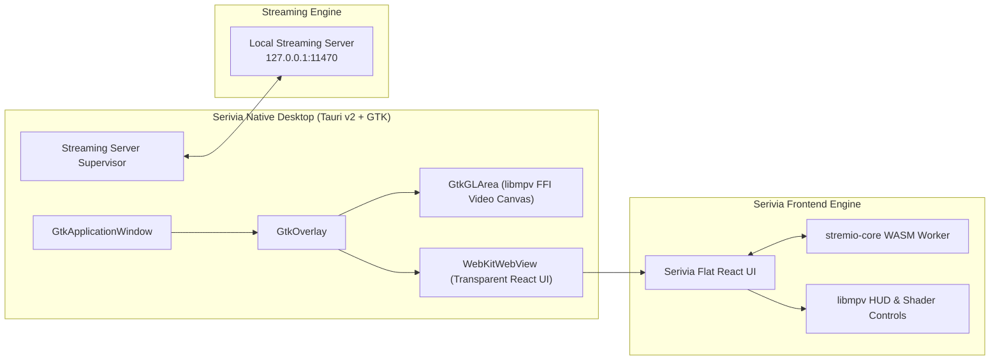

<div align="center">

# 🎬 Serivia Desktop

**Next-Generation High-Performance Streaming Platform**

*Crafted with Tauri v2, Native In-Process libmpv OpenGL Video Acceleration, WebAssembly Core Engine, and AI Video Enhancements.*

[](/LICENSE.md)
[-00C49F.svg)](#)
[](#)

</div>

---

## 🌟 Overview

**Serivia** is a high-performance, cinema-grade streaming hub built for modern desktop systems and big screens. Inspired by modern minimalist interfaces (**Serivia UI, Arctic Fuse 3, Apple TV+**), Serivia unites home recommendations and deep catalog discovery into a seamless, unified discovery experience while dramatically reducing resource overhead on low-power and high-end hardware alike.

---

## ✨ Key Features & Innovations

- 🖥️ **Native In-Process `libmpv` FFI Integration**:
  - Direct hardware-accelerated video rendering via `GtkGLArea` under a transparent WebKit GTK overlay.
  - Zero-copy native hardware decoding (`vaapi`, `nvdec`, `vdpau`) without IPC desync or window tearing on Wayland and X11 tiling window managers (Hyprland, Sway, i3, GNOME, KDE).
- ✨ **In-Player AI Video Enhancement Shaders**:
  - Zero-latency GPU shader pipeline integrated directly into the player HUD.
  - **FidelityFX CAS** (Contrast Adaptive Sharpening) for ultra-crisp 1080p $\rightarrow$ 4K clarity on live-action streams.
  - **Anime4K Lite** for fast real-time line reconstruction on animation.
  - *Strictly OFF by default* to preserve zero idle GPU overhead.
- ⚡ **Hardware Tier Resource Management**:
  - Memory-aware single-stream buffer control (Tier 1 $\le$ 8GB, Tier 2 8–16GB, Tier 3 > 16GB).
  - Eliminates wasteful preloading of unplayed episodes, dedicating 100% of bandwidth and buffer cache to active stream playback.
- 🧭 **Unified Discovery & Home Hub**:
  - Seamlessly merges Home and Discover into a single primary dock entry.
  - Instant view switcher: toggle between **`[ ☰ Curated Shelves ]`** and **`[ ⊞ Deep Catalog Grid ]`** with genre/year filters without full-page reloads.
  - Quick category filtering across *All, Movies, Series, Anime,* and *Channels*.
- 📐 **Modern Architectural Flat Design System**:
  - Strict 4px geometry, OLED layered charcoal surfaces (`#0B0B0E`, `#121217`, `#1A1A22`, `#242430`), hairline borders (`#2C2C3A`), and warm gold ratings (`#FFC107`).
  - CSS layout containment (`contain: content; content-visibility: auto;`) and zero GPU-heavy blur rasterization bottlenecks for fluid 60fps scrolling on Intel iGPUs.
- 🔄 **Integrated Streaming Engine**:
  - Local supervisor managing the embedded streaming server daemon on `127.0.0.1:11470`.

---

## 🏗️ Architecture



---

## 🚀 Getting Started

### Prerequisites
- **Linux** (Ubuntu, Debian, Arch, Fedora, openSUSE, etc.)
- **Rust / Cargo** `v1.77+`
- **libmpv** development libraries (`libmpv-dev` / `mpv-libs-devel`)
- **GTK3** development libraries (`libgtk-3-dev`)

### Quick Launch (Dev Mode)

```bash
# Launch Serivia Desktop directly with Cargo:
cargo run --bin serivia

# Or use the developer launcher script:
./scripts/desktop.sh
```

### Compiling Production Binaries

```bash
# Build optimized native binary (target/release/serivia):
./scripts/build.sh --release
```

---

## 📜 Available Scripts

| Command | Script Equivalent | Description |
|---|---|---|
| `cargo run --bin serivia` | `./scripts/dev.sh` | Launch Serivia Linux desktop client directly |
| `cargo build --bin serivia` | `./scripts/build.sh` | Compile native debug binary (`target/debug/serivia`) |
| `cargo build --release --bin serivia` | `./scripts/build.sh --release` | Compile optimized release binary (`target/release/serivia`) |
| `npm run build:ui` / `pnpm run build:ui` | - | Recompile the frontend Webpack production bundle |
| `npm run test` / `pnpm test` | `./scripts/test.sh` | Run Jest unit tests |
| `npm run lint` / `pnpm run lint` | `./scripts/lint.sh` | Run ESLint check |

---

## 🙏 Credits & Acknowledgements

Serivia is proudly developed upon the open-source foundations of the **Stremio** ecosystem. We extend our deep gratitude and full credit to:

- **Smart Code OOD** and the **Stremio Open-Source Project** ([Stremio GitHub](https://github.com/Stremio)) for creating the exceptional Stremio Core protocol, addon architecture, streaming engine (EngineFS), and community translations.
- **jurialmunkey** for the brilliant UI concepts and widget hub inspiration from **Arctic Fuse 3**.
- The **libmpv** development team for the world-class open-source media player engine.

All code originally derived from Stremio is licensed under **GPL-2.0** in accordance with its upstream licensing terms. See [`LICENSE.md`](/LICENSE.md) for complete license details.
