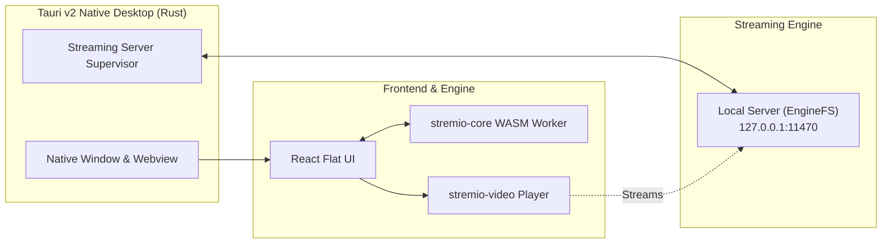

<div align="center">


# Stremio Desktop (Tauri v2)

**Freedom to Stream** — Modern, high-performance Linux desktop application powered by **Tauri v2**, **React**, **WebAssembly**, and an integrated **Stremio Streaming Server (EngineFS)**.

[](https://github.com/Stremio/stremio-web/releases)
[](/LICENSE.md)

[Website](https://www.stremio.com) · [Report an Issue](https://github.com/Stremio/stremio-web/issues/new/choose)

</div>

---

## ✨ Features

- 🖥️ **Native Linux Desktop (Tauri v2)** — Lightweight, memory-efficient native desktop application replacing legacy heavy wrappers.
- ⚡ **Integrated Streaming Server** — Bundled official Stremio Streaming Server (`server/server.js` v4.21.1 EngineFS) running locally on `127.0.0.1:11470` and automatically managed by Rust process supervisors.
- 🎬 **Cinematic Hero Banner** — Dynamic top carousel highlighting featured titles from active catalogs with quick playback actions.
- 📐 **Modern Flat UI** — Ultra-lightweight flat dark surfaces (`#0b0c10`, `#14171f`) with clean 1px borders, zero GPU-heavy backdrop blur, and zero gradient repainting bottlenecks.
- 📚 **Direct Library & New Episodes Shelves** — Quick home screen access to Continue Watching, unwatched new episodes with notification badges, and personal Library shelves.
- 🏷️ **Instant Category Filtering** — Smooth flat pill filters for *All*, *Movies*, *Series*, *Anime*, and *Channels* with live catalog updates.
- 🧩 **Addon-Powered Catalogs** — Infinite discoverability for movies, series, YouTube, and live channels powered by community addons.
- 🔄 **Universal Sync** — Seamlessly synchronizes your library, watch progress, and addon configurations across all your devices.
- 📺 **Chromecast Streaming** — Cast videos directly to big screens and smart TVs.
- 💬 **Advanced Subtitles** — Custom sizing, colors, font offsets, and real-time addon subtitle integration.
- ⌨️ **Keyboard & Gamepad First** — Full navigation and playback support without requiring a mouse.
- 🌍 **50+ Languages** — Community localized via [stremio-translations](https://github.com/Stremio/stremio-translations).

---

## 🛠 Architecture

Stremio Desktop combines high-performance native Rust desktop integration with a sandboxed WebAssembly engine:



---

## 🚀 Getting Started

### Prerequisites
- **Rust / Cargo**: `v1.75+` (for compiling and running the native Linux app)
- **Node.js** or **Bun**: (Only required if running the streaming server or recompiling UI)

### Quick Start (Launch Native Linux Client)

You do **not** need to install packages or run `pnpm install`. All frontend assets are already embedded into the Rust desktop binary. Simply run:

```bash
# Launch Stremio Desktop with Cargo
cargo run --bin stremio

# Or use the helper script:
./scripts/dev.sh
```

---

## 📦 Building Distribution Packages

To compile the native production Linux binaries and distribution packages (`.AppImage` and `.deb`):

```bash
pnpm run build
# or:
./scripts/build.sh
```

Compiled packages are saved to:
`src-tauri/target/release/bundle/`

---

## 📜 Available Scripts

| Command | Script Equivalent | Description |
|---|---|---|
| `cargo run --bin stremio` | `./scripts/dev.sh` | Launch Stremio Linux desktop client directly |
| `cargo build --bin stremio` | `./scripts/build.sh` | Compile native debug binary (`target/debug/stremio`) |
| `cargo build --release --bin stremio` | `./scripts/build.sh --release` | Compile optimized release binary (`target/release/stremio`) |
| `npm test` / `pnpm test` | `./scripts/test.sh` | Run Jest unit tests and AST translation check |
| `npm run lint` / `pnpm run lint` | `./scripts/lint.sh` | Run ESLint check |
| `npm run lint:fix` / `pnpm run lint:fix` | `./scripts/lint.sh --fix` | Automatically fix linting violations |
| `npm run server:download` | `./scripts/download-server.sh` | Download official Stremio EngineFS server bundle |
| `npm run server:run` | `./scripts/run-server.sh` | Run standalone local streaming server on port 11470 |

---

## 📄 License

Copyright © 2017-2026 Smart Code OOD. Released under the GPL-2.0 license — see [LICENSE](/LICENSE.md).
