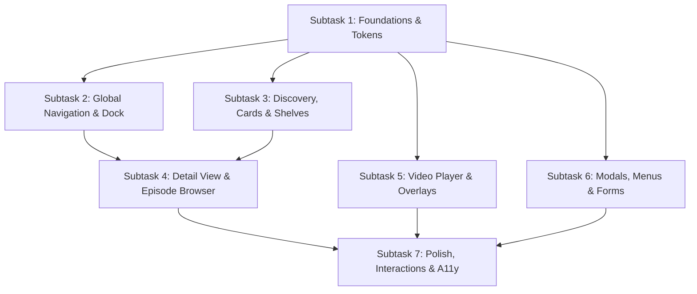

# Springroll Unified Flat Design System (New Design & Research Roadmap)

## 1. Vision & Core Philosophy

Springroll's new unified design system is built upon **Modern Architectural Flat Minimalism**:
- **Geometry**: Strict square-based architecture with subtle, intentional rounded corners (`4px` standard). Elimination of disparate bubble pills, inconsistent radii, and unnecessary decorative skeuomorphism.
- **Color Progression**: Immersive OLED-friendly dark mode utilizing layered charcoal surfaces (`#0D0D11` $\rightarrow$ `#17171E` $\rightarrow$ `#21212B` $\rightarrow$ `#2B2B38`) with hairline geometric borders (`#2C2C3A`) instead of blurry shadows.
- **Accents**: High-contrast, vibrant primary accent (Crisp Mint `#00C49F` / Electric Ember `#FF6600`) paired with Warm Gold (`#F4D06F` / `#FFC107`) for ratings and technical badges.
- **Typography Engine**: 
  - **Headings & Navigation**: `Plus Jakarta Sans` (Geometric, wide apertures, sharp modern presence).
  - **Body & Metadata**: `Inter` (Optimized for small-screen digital clarity).
  - **Diagnostics & Technical Metrics**: `JetBrains Mono` / `Fira Code` (Tabular numerals, monospaced alignment).

---

## 2. Research Breakdown & Subtask Roadmap

To systematically audit, research, and execute the unified flat redesign across the entire application, the work is partitioned into **7 focused subtasks**:

---

### Subtask 1: Design Tokens & Foundations Harmonization [COMPLETED]
- **Objective**: Establish a singular source of truth for all color, spacing, radius, and typography tokens, eliminating any legacy Stremio purples or ad-hoc inline styles.
- **Completed Work & Architectural Standards**:
  1. **Canonical Flat Tokens Established (`variables.less`, `theme.less`)**:
     - Canvas Background: `@flat-canvas` / `--flat-canvas`: `#0D0D11`
     - Primary Surface: `@flat-surface-1` / `--flat-surface-1`: `#17171E`
     - Elevated Surface: `@flat-surface-2` / `--flat-surface-2`: `#21212B`
     - High Elevation: `@flat-surface-3` / `--flat-surface-3`: `#2B2B38`
     - Hairline Border: `@flat-border` / `--flat-border`: `#2C2C3A`
     - Primary Accent: `@flat-accent` / `--flat-accent`: `#FF6600` (Electric fiery ember)
     - Warm Gold: `@flat-warm-gold` / `--flat-warm-gold`: `#FFC107`
     - Typography: Primary `@flat-text-primary`: `#EDEDF2`, Secondary `@flat-text-secondary`: `#8F8FA0`, Muted `@flat-text-muted`: `#5E5E6E`.
  2. **Geometry Standardized**:
     - Architectural 4px radii: `@radius-md: 4px`, `@radius-pill: 4px`, `--border-radius: 4px`.
  3. **Stremio Purple & Legacy Variables Purged**:
     - `ToastItem/styles.less`: Replaced `@color-primary-light2` (purple) with `var(--primary-accent-color)`.
     - `StreamingServerWarning.less`: Replaced `@color-accent5-dark3` and `0.5rem` radius with `var(--cr-surface-1)`, `1px solid var(--cr-border)`, and `4px` radius.
     - `PasswordResetModal/styles.less`: Replaced `@color-accent5-90` with `var(--danger-accent-color)`.
     - `SpeedMenu/styles.less` & `VolumeSlider/styles.less`: Replaced `@color-secondaryvariant1-light4` with `var(--primary-accent-color)`.
     - `Search/styles.less` & `NotFound/styles.less`: Replaced `@color-secondaryvariant2-light1-90` with `var(--stremio-text-secondary)` and `Plus Jakarta Sans` typography.

---

### Subtask 2: Global Navigation Dock & Header Unification
- **Objective**: Create a seamless, responsive application frame with cohesive top and side navigation.
- **Research Items**:
  1. **Vertical Dock (`VerticalNavBar`)**:
     - Standardize icon size (`24px`), label typography (`Plus Jakarta Sans`), and subtle 4px active pill background.
     - Optimize transition curve (`140ms ease-in-out`) for hover and selection states.
     - Evaluate auto-collapse behavior on tablet and desktop window resizing.
  2. **Horizontal App Bar (`HorizontalNavBar`)**:
     - Harmonize title typography and breadcrumbs.
     - Redesign the search bar into a crisp flat input with unified focus rings.
     - Align user profile avatar, notification badge, and window controls.

### Subtask 3: Discovery, Cards & Shelves Architecture
- **Objective**: Unify all media representations across Board, Catalog, and Library views.
- **Research Items**:
  1. **Card Aspect Ratios & States (`MetaItem`, `LibItem`)**:
     - Poster (2:3), Square (1:1), and Landscape (16:9).
     - Uniform hover elevation: `2px solid var(--primary-accent-color)` flat border ring, `1.05x` scale, smooth play-button hover reveal.
     - Flat progress bar: flush bottom alignment, 3px height, high-contrast accent fill.
  2. **Continue Watching Shelf (`ContinueWatchingItem`)**:
     - Aspect ratio standardization (16:9 widescreen still).
     - Typography treatment for episode tags: `S{season} E{episode} • {Title}`.
     - Contextual actions: fast rewind and one-click notification dismissal.
  3. **Hero Banner (`HeroBanner`)**:
     - Multi-tier vignette gradients (ensuring legible text on high-key backdrops).
     - Badging hierarchy: Audio format, Content type, Aggregate ratings (IMDb/TMDB/Trakt).
  4. **Category Filter Carousel (`CategoryPills`)**:
     - Flat rectangular pill buttons (`4px` radius) with seamless active state transition.

### Subtask 4: Media Detail View & Episode Browser
- **Objective**: Redesign the comprehensive title detail page (`MetaDetails`) for movies and television series.
- **Research Items**:
  1. **Header & Backdrop Presentation**:
     - Transparent clearlogo asset rendering (Fanart.tv / TMDB integration).
     - High-density metadata header (synopsis, director, cast chips, certification tags).
  2. **Season & Episode Grid**:
     - Flat season selector tabs.
     - Episode list cards: clean landscape thumbnails, runtime badges, air dates, and progress indicators.
  3. **Stream Links & Addon Providers List**:
     - Cleanly formatted provider cards with resolution badges (4K, 1080p, HDR, DV), audio codecs, and stream sources.

### Subtask 5: Video Player Interface & Overlay Controls
- **Objective**: Deliver a cinema-grade, distraction-free video playback interface.
- **Research Items**:
  1. **Scrubbing & Timeline (`Slider`)**:
     - Minimalist progress track with buffered segment visualization.
     - Thumbnail preview tooltip on timeline hover.
  2. **Overlay Control Bar**:
     - Play/pause, skip intro (+85s / +10s), next episode, audio boost scale.
     - Subtitle styling menu (custom fonts, sizes, offsets, color pickers).
     - Audio track selector flyout.
  3. **Stream Diagnostics HUD (`StatisticsMenu`)**:
     - JetBrains Mono monospaced tabular dashboard for bitrate, dropped frames, cache buffer, peer connections, and info-hash.

### Subtask 6: Interactive Modals, Flyout Menus & Form Elements
- **Objective**: Standardize all secondary and tertiary UI elements.
- **Research Items**:
  1. **Modals & Dialogs (`ModalDialog`, `EventModal`)**:
     - `#21212B` surface with `4px` radius and crisp hairline borders.
     - Scoped scrollable content containers and standard action button footers.
  2. **Flyout Menus (`ContextMenu`, `Popup`, `Dropdown`)**:
     - Unified focus and hover states for menu items.
     - Keyboard navigation (`ArrowUp`, `ArrowDown`, `Enter`, `Escape`).
  3. **Form Controls (`Toggle`, `Checkbox`, `TextInput`, `Select`)**:
     - Geometric flat toggles and checkboxes with crisp color-switching micro-animations.

### Subtask 7: Polish, Transitions, Micro-Animations & Accessibility
- **Objective**: Optimize end-to-end responsiveness, smooth animations, and keyboard accessibility.
- **Research Items**:
  1. Consistent focus rings using `outline: 2px solid var(--primary-accent-color)`.
  2. Hardware-accelerated CSS transitions (`scale`, `opacity`, `transform`) with zero layout thrashing.
  3. Touch interaction adaptations (`pointer: coarse` rules, touch target padding).
  4. Performance validation: ensure 60fps scrolling and rapid route transitions.

---

## 3. Next Step & Execution Plan

We will proceed with research and implementation starting from **Subtask 1: Design Tokens & Foundations Harmonization**, establishing the global tokens, variables, and typography rules that all subsequent components will inherit.
